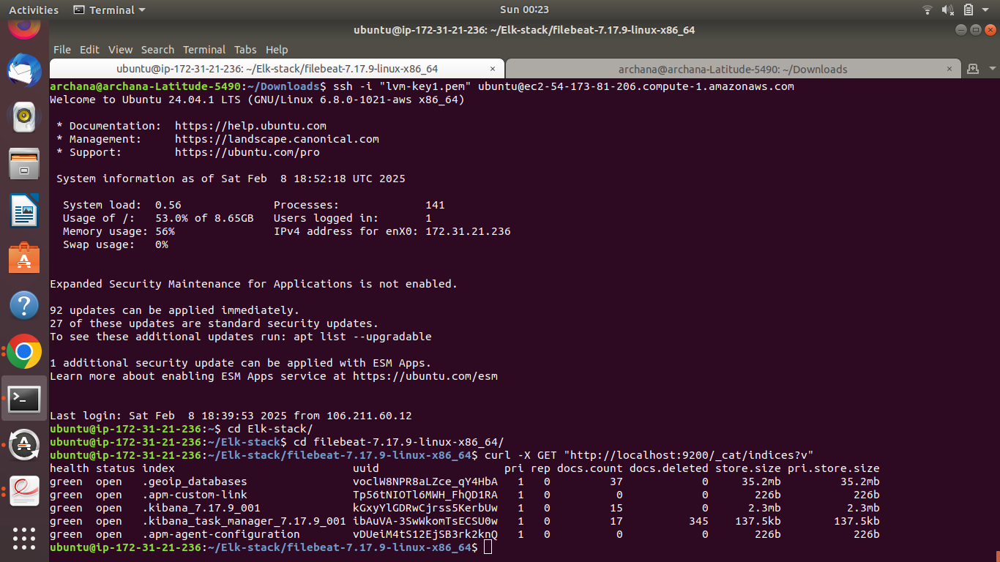
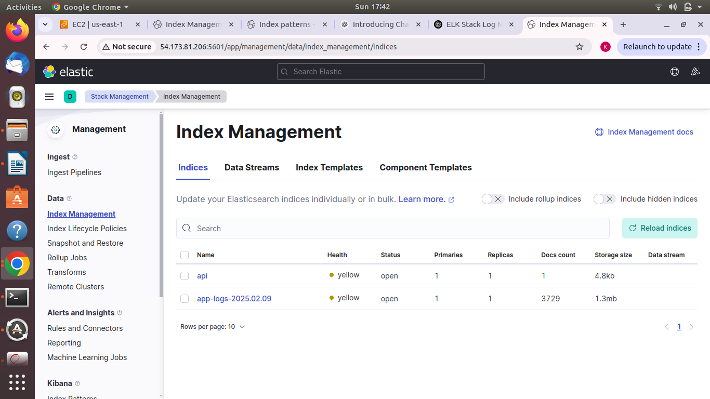
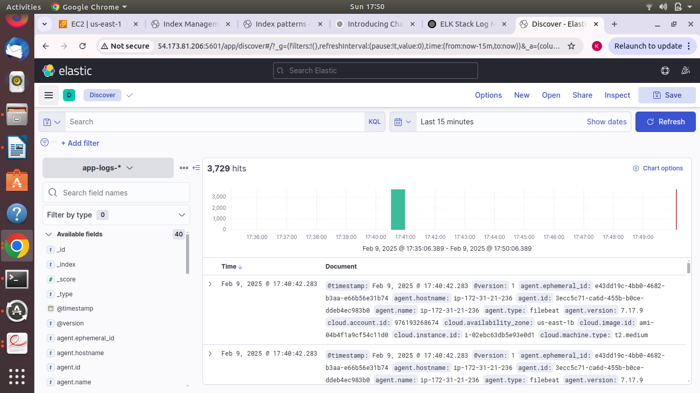

# Log Monitoring with ELK Stack

# 📌  Goal

Implement centralized logging using Elasticsearch, Logstash, and Kibana (ELK) to collect, process, and visualize application logs efficiently.

## Tech Stack

- **Elasticsearch:** Stores and indexes logs

- **Logstash:** Processes and forwards logs

- **Kibana:** Visualizes logs with dashboards

- **Filebeat:**  Collects logs from applications

- **Docker:**  Containerizes the ELK Stack

## Installation Steps

## 1️⃣ Install ELK Stack using Docker Compose

Ensure you have Docker and Docker Compose installed:

    sudo apt update && sudo apt install -y docker.io
    sudo apt install -y docker-compose

## Verify installation:

    docker --version
    docker-compose --version
  
## 2️⃣ Install ELK Stack Using Docker Compose
### Create a Project Directory

    mkdir elk-stack 
    cd elk-stack

 ### Create a docker-compose.yml File
 Define your ELK services inside this file.
 
    nano docker-compose.yml

### Create a Logstash Configuration File (logstash.conf)

    nano logstash.conf
    

 
    

### Start ELK Stack Using Docker Compose
    docker-compose up -d

### Check running containers:
    docker ps

    
### 3️⃣ Configure Filebeat to Collect Logs
#### Install Filebeat
    curl -L -O https://artifacts.elastic.co/downloads/beats/filebeat/filebeat-7.17.9-linux-x86_64.tar.gz
    tar -xzf filebeat-7.179-linux-x86_64.tar.gz
    cd filebeat-7.17.9-linux-x86_64

 #### Edit Filebeat Configuration (filebeat.yml)

 ##### Edit this data in filebeats input
    filebeat.inputs:
        - type: log
         enabled: true
         paths:
         - /var/log/*.log  # Change this to your application log path
##### Edit this data in Logstash output
    output.logstash:
    hosts: ["localhost:5044"]

##### Start Filebeat
    ./filebeat -e

## 4️⃣ Verify Data in Elasticsearch
#### 
#### Run:
    curl -X GET "http://localhost:9200/_cat/     indices?v"

##### You should see an index like app-logs-2025.02.06.

## 5️⃣ Visualize Logs in Kibana
#### Open Kibana in your browser:

    http://localhost:5601

##### Go to Stack Management → Index Patterns. Click Create Index Pattern and enter app-logs-*. Choose @timestamp as the time field. Save and go to Discover to view logs.

## Outcome
##### A centralized logging system where:
- Logs from your application are collected by Filebeat.
- Logstash processes and forwards them to Elasticsearch.
- Kibana helps visualize the logs.

